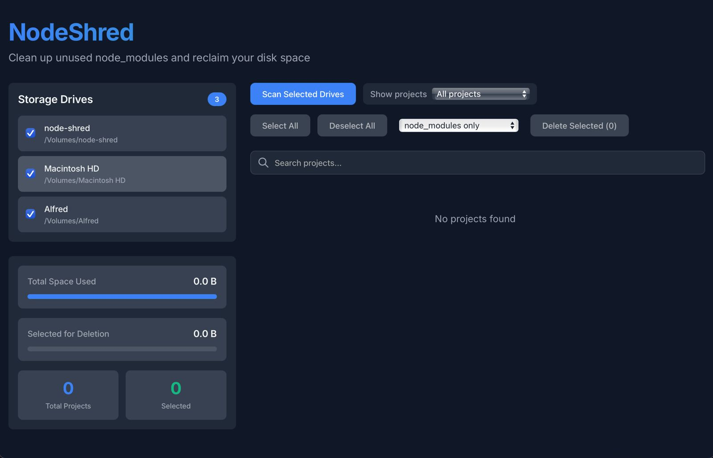

# NodeShred

NodeShred is a powerful desktop application built with Tauri and React that helps you reclaim disk space by cleaning up unused node_modules and build directories from your projects.



## Features

- 🔍 Smart project detection across multiple drives
- 🧹 Selective cleanup of:
  - `node_modules` directories
  - Build directories (`dist`, `build`, `.next`, `out`)
  - Cache directories (`.cache`, `.parcel-cache`, `.webpack`)
- 📊 Visual size summaries and space savings
- 🔎 Project search and filtering
- ⏳ Age-based filtering (show projects older than X days)
- 💾 Multi-drive support
- 🖥️ Cross-platform (Windows, macOS, Linux)

## Installation

Download the latest release for your platform from the [Releases](https://github.com/kuldeepdhaka/node-shred/releases) page.

### Platform-Specific Notes

#### macOS

By default, macOS may prevent running applications from unidentified developers. To run NodeShred:

1. **First Launch**:
   - Right-click (or Control-click) the app
   - Select "Open" from the context menu
   - Click "Open" in the dialog

2. **Alternative Method** (if needed):
   ```bash
   # Enable apps from anywhere (use with caution)
   sudo spctl --master-disable
   
   # To revert this setting later:
   sudo spctl --master-enable
   ```

   Then:
   1. Go to System Preferences > Security & Privacy > General
   2. Click the lock to make changes
   3. Select "Allow apps downloaded from: Anywhere"

#### Linux

Ensure you have the required dependencies:
```bash
# Ubuntu/Debian
sudo apt-get install libwebkit2gtk-4.0-0 libgtk-3-0

# Fedora
sudo dnf install webkit2gtk3 gtk3

# Arch
sudo pacman -S webkit2gtk gtk3
```

## Development

### Prerequisites

- Node.js (v18 or later)
- Rust (latest stable)
- Bun (latest)

### Setup

1. Clone the repository:
   ```bash
   git clone https://github.com/kuldeepdhaka/node-shred.git
   cd node-shred
   ```

2. Install dependencies:
   ```bash
   bun install
   ```

3. Run in development mode:
   ```bash
   bun run tauri dev
   ```
   OR
   ```bash
   bunx tauri dev
   ```

### Building

To create a production build:
```bash
bun run tauri build
```

## Contributing

Contributions are welcome! Please feel free to submit a Pull Request.

## License

MIT License - see [LICENSE](LICENSE) for details.

## Security Note

NodeShred requires filesystem access to scan and clean up project directories. Always review the directories before deletion and ensure you have backups of important data.
